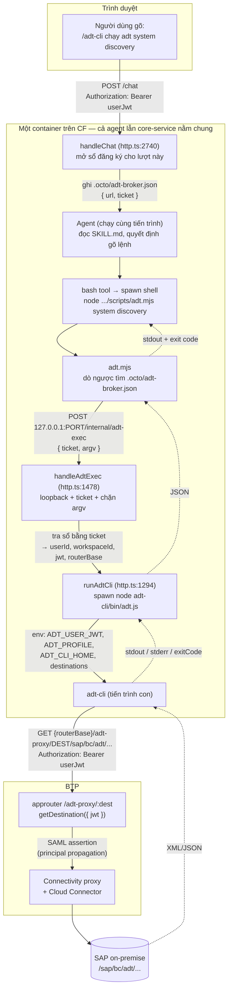
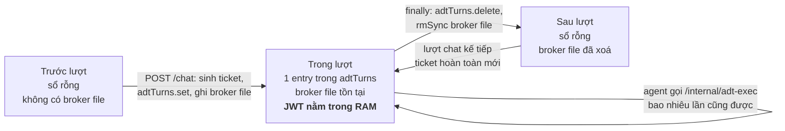

# Agent gọi ADT qua broker — luồng chạy và dữ liệu trong RAM

Tài liệu này mô tả đường đi khi **agent** chạy một lệnh ADT, sau thay đổi đánh dấu
`//IYH1HC SAP ADT add` trong `core-service/src/http.ts`.

Nguyên tắc thiết kế: **trao năng lực, không trao chứng chỉ** — agent chạy được lệnh ADT nhân danh
user, nhưng không cầm token của user.

> ⚠️ **Cơ chế mô tả ở đây đang được đề xuất thay.** Ticket + broker file + `/internal/adt-exec` sẽ bị
> bỏ, thay bằng một tool native gắn với phiên chat — xem
> [agent-capability-tool.vi.md](agent-capability-tool.vi.md). Tài liệu này vẫn đúng với mã đang chạy,
> nên giữ để đối chiếu; nhưng đừng dựa vào nó để thiết kế tích hợp mới. Đặc biệt lưu ý §2.4 của tài
> liệu kia: broker file là **một ô duy nhất cho cả workspace**, nên hai lượt chồng nhau sẽ đè lên nhau
> và chạy nhầm danh tính.

---

## 1. Vì sao cần broker

Khi **user bấm nút** trên UI, `runAdtCli` bơm `ADT_USER_JWT` + `destinations` vào tiến trình con, nên
adt-cli đi đúng đường: approuter → PrincipalPropagation → on-prem.

Khi **agent gõ `adt`** qua bash tool thì không một dòng code ADT nào của core-service chạy — shell tự
phân giải `adt` từ `PATH`, tiến trình con không có JWT lẫn destination. adt-cli rơi vào nhánh XSUAA,
gọi ra `<uaa>/oauth/token`, và container không có egress nên chết ở `ENOTFOUND`.

Broker đưa lệnh của agent **quay về tiến trình core-service** — nơi đã có sẵn JWT của lượt hiện tại.

---

## 2. Luồng đầy đủ

Chặng cuối (`adt-cli` → approuter → on-prem) **không đổi một dòng nào** — đó chính là đường mà nút bấm
trên UI vẫn đang chạy. Broker chỉ làm một việc: đưa lệnh của agent vào đúng tiến trình đó.

### Vì sao URL là `http://127.0.0.1:${this.port}`

Agent chạy làm tiến trình con **cùng container** với core-service (`mta.yaml` khởi động không có
`--sandbox`, nên `parseArgs` để mặc định `{type:"host"}` và `resolveWorkspaceSandbox` trả về ngay ở
dòng đầu). Nên:

- Không đi qua approuter: mọi route đều `authenticationType: xsuaa`, script không có token → 401.
- Không đi qua route công khai của `octo-srv`: container không có egress, và đó cũng chính là kiểu
  request làm `adt` trần chết `ENOTFOUND`.
- `this.port` là cổng đang bind thật (`--http $PORT` trên CF, `PORT`/`3030` khi chạy local), cùng biến
  truyền vào `app.listen`.

Đây cũng là lý do `handleAdtExec` từ chối mọi caller không phải loopback: route này nằm **trên**
`requireAuth`, mà `octo-srv` lại có route công khai — không chặn thì thành một endpoint chạy lệnh SAP
mở ra internet.

---

## 3. Cái gì được ghi vào RAM khi agent gọi ADT

### 3.1 Sổ đăng ký của lượt — `HttpServer.adtTurns`

Một `Map` trong tiến trình core-service, khoá bằng ticket ngẫu nhiên 32 byte (64 ký tự hex):

| Trường | Nội dung | Nguồn |
|---|---|---|
| *(khoá)* | `ticket` — `randomBytes(32).toString("hex")` | sinh mới **mỗi lượt chat** |
| `userId` | id user của lượt | `http.ts:2750` |
| `workspaceId` | workspace của session | `session.workspaceId` |
| `jwt` | **JWT sống của user** (XSUAA bearer trên request) | `extractUserJwt(req)` |
| `routerBase` | base URL của approuter | `resolveRouterBase(req)` |

**Vòng đời:** tạo ngay trước `handler.handleEvent`, xoá trong `finally` cùng lượt. Ngoài lượt, `Map`
rỗng → ticket cũ tra không ra gì → route trả 401.

### 3.2 Trong lúc một lệnh đang chạy

| Nằm ở đâu | Nội dung |
|---|---|
| Object `env` dựng trong `runAdtCli` (`http.ts:1314`) | bản sao **toàn bộ `process.env`**, cộng `ADT_CLI_HOME`, `ADT_USER_JWT` (bản sao của `jwt`), `ADT_PROFILE`, và `destinations` = JSON `[{ name, url: "{routerBase}/adt-proxy/{name}", forwardAuthToken: true }]` |
| Bộ đệm `stdout` / `stderr` trong `runAdtCli` | kết quả lệnh, **cắt ở 10 MB** mỗi luồng |
| RAM của tiến trình `adt-cli` | JWT (đọc từ `ADT_USER_JWT`), record destination đã resolve, cache CSRF/cookie của phiên ADT |

Lưu ý: vì `env` sao nguyên `process.env`, tiến trình `adt-cli` con thừa kế cả những biến không liên
quan như `CORE_SERVICE_ENCRYPTION_KEY`, `DATABASE_URL`.

### 3.3 Agent cầm những gì

| Agent thấy | Agent **không** thấy |
|---|---|
| `ticket` (đọc được từ broker file) | JWT của user |
| `argv` do chính nó soạn | `routerBase`, tên destination |
| `stdout` / `stderr` / exit code của lệnh | nội dung sổ đăng ký |

Ticket là **năng lực, không phải danh tính**: nó chỉ cho phép chạy lệnh ADT trong đúng lượt hiện tại —
thứ agent vốn đã được phép làm — mang ra ngoài lượt là vô dụng.

---

## 4. Cái gì nằm trên đĩa

| File | Nội dung | Vòng đời |
|---|---|---|
| `<workspaceRoot>/.octo/adt-broker.json` | `{ url, ticket }` — **không có JWT** | xoá ở `finally` cuối lượt |
| `users/<id>/connectors/sap-adt/home/.adt-cli/config.json` | hồ sơ kết nối: `kind`, `destinationName`, `client`, `language`… | lâu dài |

`.octo/` nằm ở gốc workspace nên **không hiện trong cây Artifacts/Skills** trên UI (cây chỉ đi vào hai
thư mục đó).

### ⚠️ Một điều chưa ổn, có sẵn từ trước — đã đóng phần lớn 2026-08-21

`config.json` **từng chứa `userJwt` ở dạng plaintext**, cộng cả ticket `MYSAPSSO2` (`ssoToken`) của
profile `basicsso`. Nghĩa là bí mật dạng bearer nằm trên đĩa, và agent vẫn đọc được: `ADT_CLI_HOME`
chưa gỡ khỏi env agent, còn `HostExecutor.resolvePath` (`core-agent/src/sandbox.ts:275`) không clamp
đường dẫn nên tool `read` đi tới đâu cũng được.

Ba việc phải làm, nay còn hai:

1. ~~Đừng lưu `userJwt` vào hồ sơ.~~ **XONG.** Octo thôi truyền `--user-jwt` lúc tạo connection (JWT
   đi qua env `ADT_USER_JWT` như `runAdtCli` vẫn làm), và adt-cli chặn `userJwt`/`ssoToken`/`ssoUser`
   ngay trong `config.save()` lẫn `getProfile()`. Ticket SSO cũng không xuống đĩa nữa — mỗi tiến
   trình tự bắt tay SPNEGO. `config.json` giờ chỉ còn metadata kết nối.
2. Gỡ `ADT_CLI_HOME` khỏi env agent, kèm chặn `adt auth profile path` ở broker — nếu không agent chỉ
   cần hỏi đường dẫn rồi tự đọc.
3. Dựng path jail cho `HostExecutor`.

---

## 5. Hàng rào đang có ở `/internal/adt-exec`

| Lớp | Chặn cái gì |
|---|---|
| Loopback (`http.ts:1479`) | request từ ngoài container, qua route công khai của `octo-srv` |
| Ticket (`http.ts:1485`) | caller trong container nhưng không thuộc lượt đang chạy — gồm cả agent của session khác |
| Chặn argv (`http.ts:1496`) | URL tuyệt đối (adt-cli nhận absolute URL rồi gửi JWT sống tới đó), và `--output`, `--user-jwt`, `--iss`, `--service-binding` |

Suy connection chạy theo thứ tự `-p`/`--profile` → `--name` (chỉ với nhóm `auth`) → `defaultProfile`.
`--name` **không** phải bộ chọn profile ở chỗ khác: với `object activate` nó là tên đối tượng ABAP.
