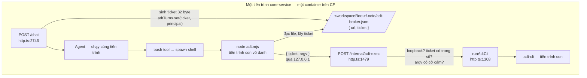
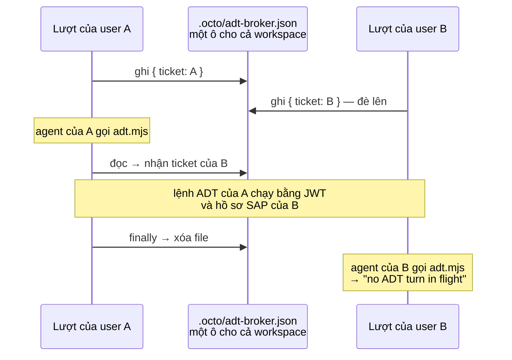
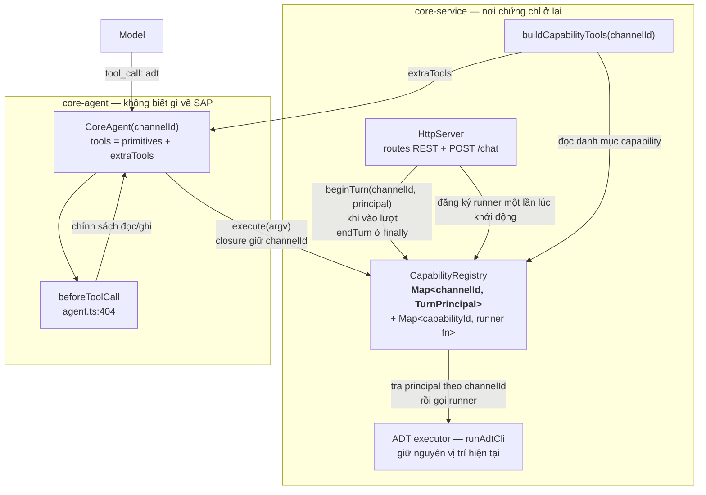
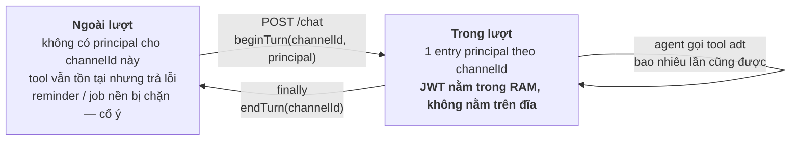
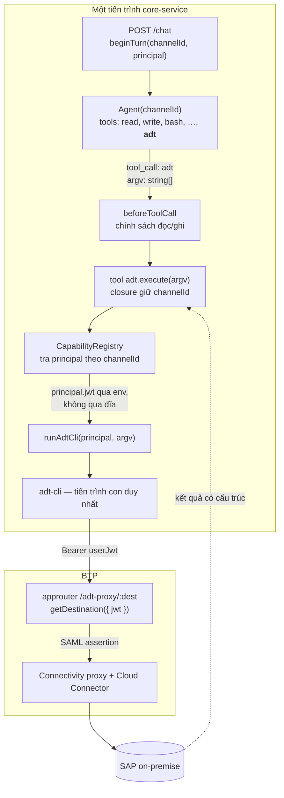
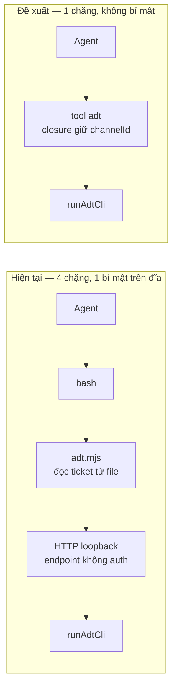
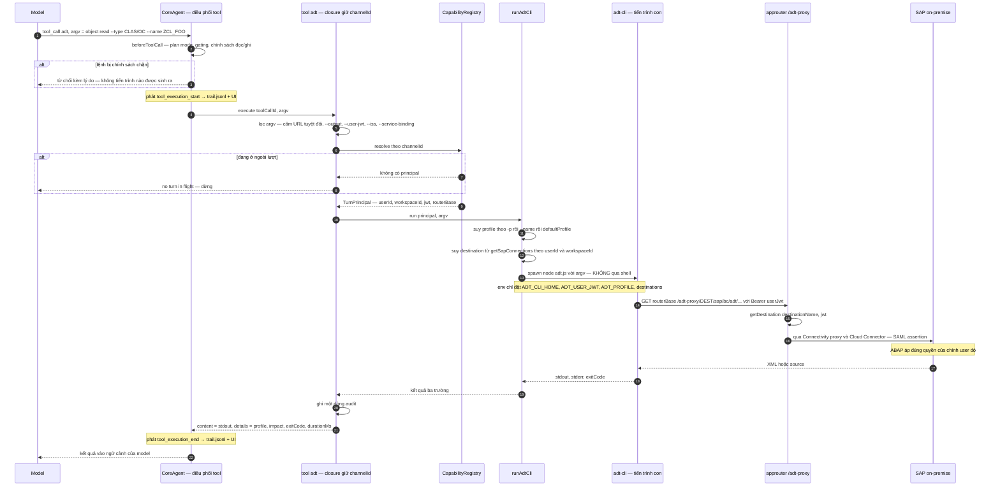
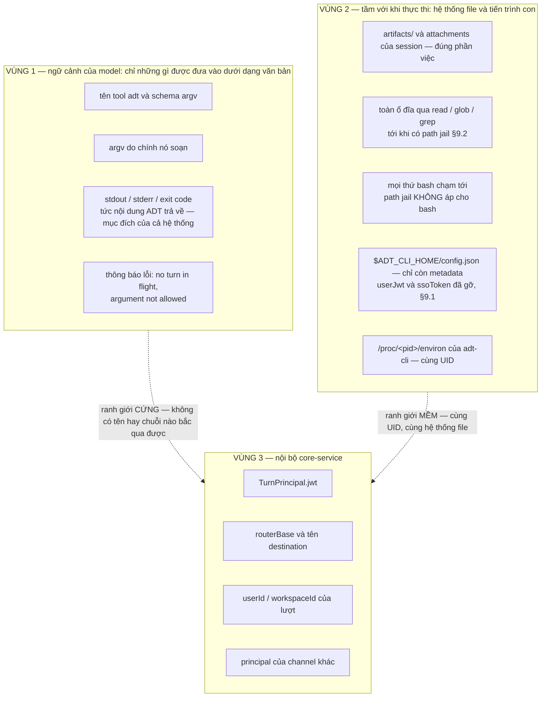

# Trao năng lực cho agent bằng tool native

Đề xuất thay cơ chế **ticket broker** hiện tại bằng **tool native gắn với phiên**, cho đường SAP ADT và
cho mọi tích hợp về sau.

Tài liệu này là hồ sơ xin phê duyệt. Nó mô tả cơ chế đang chạy, chỉ ra thứ cơ chế đó không thể bảo đảm,
đề xuất cơ chế thay thế, và nói rõ cái gì được giải quyết cùng cái gì **không**.

Đọc kèm: [agent-delegation.vi.md](agent-delegation.vi.md) (khung ba lớp A/B/C) và
[adt-broker-flow.vi.md](adt-broker-flow.vi.md) (cơ chế hiện tại, chi tiết).

---

## 1. Tóm tắt cho người duyệt

| | Hiện tại | Đề xuất |
|---|---|---|
| Agent cầm gì để chạy lệnh ADT | một **ticket** — chuỗi bí mật đọc từ file | **không gì cả** — gọi một tool có sẵn trong danh sách tool của phiên |
| Bí mật nằm trên đĩa | có (`.octo/adt-broker.json`) | không |
| Agent workspace A với tới được năng lực của workspace B | **được**, chỉ cần đọc file bằng `../..` | không — không có tên hay chuỗi nào để giả mạo |
| Hai lượt chồng nhau trong một workspace | **chạy nhầm danh tính** — lượt sau đè broker file, lượt trước chạy nhân danh user sau (§2.4) | mỗi lượt một entry riêng, không có ô dùng chung |
| CLI bên thứ ba (codex/gemini/claude) do `acp_delegate` spawn | **có** đầy đủ năng lực ADT của user | không — tool là in-process (§4.8) |
| Endpoint HTTP không xác thực trong service | có (`/internal/adt-exec`) | **xóa bỏ** |
| Số tiến trình mỗi lệnh ADT | 3 (bash → `adt.mjs` → `adt-cli`) | 1 (`adt-cli`) |
| Lệnh đi qua shell | có — argv phải qua trích dẫn của shell | không — mảng argv vào thẳng `spawn` |
| Dấu vết audit | một dòng lệnh bash, kết quả lẫn trong stdout | một lời gọi tool có cấu trúc, ghi được đủ trường |
| Chặn lệnh ghi (activate, sửa source) | không có chỗ nào để chặn | chặn được tập trung ở `beforeToolCall` |

Hai sơ đồ người duyệt nên xem trước: **§4.9** — đường chạy đầy đủ của một lệnh, từ lúc model gõ tới
lúc nhận kết quả; và **§4.10** — ranh giới thông tin, agent đọc được gì và không đọc được gì.

**Thay đổi cốt lõi:** năng lực thôi được biểu diễn bằng *một chuỗi bí mật*, mà bằng *một tham chiếu*.
Chuỗi thì ai đọc được cũng dùng được. Tham chiếu thì chỉ tồn tại bên trong đối tượng agent của đúng
phiên đó, và không có cách nào gọi tên nó từ bên ngoài.

**Không giải quyết được:** JWT của user vẫn là token vạn năng (lớp B vẫn passthrough — xem §8).

---

## 2. Cơ chế hiện tại và chỗ nó hụt

### 2.1 Đường đi hôm nay



Ticket phải đi qua file **vì tiến trình con không có danh tính**. `adt.mjs` là một tiến trình Node bất
kỳ do shell sinh ra; khi nó gõ cửa `/internal/adt-exec`, endpoint không có cách nào biết nó thuộc phiên
nào — nên phải bắt nó trình một chuỗi bí mật.

### 2.2 Hai hàng rào, và vì sao cả hai đều không phải ranh giới

`handleAdtExec` dựng hai hàng rào (`http.ts:1480`, `http.ts:1486`):

**Hàng rào loopback** chỉ chặn được người ngoài container. Nhưng agent *ở trong* container. Bài học
cùng họ: IMDS của AWS từng chỉ nghe loopback rồi bị SSRF quét sạch, phải ra IMDSv2. **Loopback không
phải ranh giới bảo mật khi mã không tin cậy dùng chung namespace.**

**Hàng rào ticket** chặn được caller không thuộc lượt đang chạy — *với điều kiện* caller không đọc được
ticket. Điều kiện đó hiện không đứng vững:

- Thư mục làm việc của agent là `<workspaceRoot>/artifacts` (`core-agent/src/agent.ts:317-319`).
- Broker file ở `<workspaceRoot>/.octo/adt-broker.json` — cách đúng **một** bậc `..`.
- `HostExecutor.resolvePath` (`core-agent/src/sandbox.ts:275`) không clamp gì: đường dẫn tuyệt đối và
  `..` đi thẳng.
- Mọi workspace là thư mục anh em cùng một gốc (`core-service/src/workspaces.ts:515`).

Nên agent của workspace A đọc được `../../<workspace-B>/.octo/adt-broker.json`. Nếu B đang có lượt
chạy thì ticket đó **bảo đảm còn sống** → chạy lệnh ADT nhân danh user B, trên hệ thống SAP của B.

### 2.3 Vì sao "vá bằng path jail" là chưa đủ

Path jail cho `HostExecutor` là việc **phải làm** (xem §9), nhưng nếu nó là thứ duy nhất đỡ toàn bộ cơ
chế thì:

- Một lỗi trong jail — symlink, đường dẫn UNC trên Windows, `realpath` sau khi resolve, một tool mới
  quên gọi `resolvePath` — là mất trọn vẹn năng lực ADT của mọi user.
- Jail chỉ chặn được `read`/`glob`/`grep`. **`bash` không đi qua `resolvePath`** — nó `spawn` shell với
  `cwd`, và trong shell thì `cat ../../..` là chuyện của kernel, không phải của TypeScript. Muốn bịt
  đường này phải có container theo workspace, tức Mốc 3.

Nói gọn: **chừng nào năng lực còn là một chuỗi nằm trên đĩa, việc bảo vệ nó phụ thuộc vào việc bịt kín
mọi đường đọc file — mà `bash` thì không bịt được trong kiến trúc một container.**

### 2.4 Một lỗi danh tính chéo đang có thật, không phải giả định

Ba dữ kiện, ghép lại thành một lỗi:

1. **Broker file là một ô duy nhất cho cả workspace.** `join(workspaceRoot, ".octo", "adt-broker.json")`
   (`core-service/src/http.ts:2747`) — theo workspace, **không** theo session. `adt.mjs` dò ngược lên
   tới đó (`scripts/adt.mjs:23-31`), nên mọi session trong workspace đọc đúng một file.
2. **Nhiều user làm việc cùng lúc trong một workspace là bình thường.** Quyền vào session xét theo
   *thành viên workspace*, không theo người tạo: `listSessions` trả về mọi session trong workspace cho
   bất kỳ thành viên nào (`core-service/src/workspaces.ts:467-485`), và `handleChat` chỉ kiểm tra
   `assertWorkspaceAccess`.
3. **File được ghi lúc nhận request, còn lượt thì chạy sau khi xếp hàng.** `handleChat` ghi ở
   `http.ts:2755` rồi mới gọi `handler.handleEvent`, mà hàm đó đưa lượt vào hàng đợi của channel và
   chờ tới lượt (`core-service/src/main.ts:408-437`).

Hệ quả với hai lượt chồng nhau trong cùng một workspace — hai user, hoặc một user hai tab:



Hỏng cả hai chiều: A chạy nhân danh B, rồi B mất năng lực giữa chừng. Sổ `adtTurns` trong RAM khóa
theo ticket nên bản thân nó không đè nhau — nhưng không cứu được, vì thứ agent đọc là **file**.

Nguyên nhân gốc: **năng lực đặt ở một ô dùng chung theo workspace, trong khi danh tính thì theo lượt.**
Đây chính là thứ §4.7 phải sửa, và là lý do đề xuất này không chỉ là "cho gọn hơn".

> **Quyết định về xử lý tạm.** Đã cân nhắc hotfix riêng (dời broker file xuống session root và dời chỗ
> ghi vào trong lượt đã xếp hàng) và **quyết định không làm** — lỗi này được sửa cùng đề xuất, không
> tách. Nghĩa là rủi ro được **chấp nhận có ý thức cho tới khi triển khai xong**, và đây là một lý do
> để duyệt sớm chứ không phải một chi tiết kỹ thuật.
>
> Biện pháp giảm thiểu trong thời gian chờ, thuần vận hành: **tránh để hai người chạy lệnh SAP cùng
> lúc trong một workspace.** Hai workspace riêng thì không dính lỗi này, vì broker file tách theo
> workspace.

---

## 3. Đề xuất: năng lực là tham chiếu, không phải bí mật

### 3.1 Ý tưởng một câu

Ticket tồn tại **chỉ vì** năng lực phải đi qua một tiến trình con vô danh. Nếu năng lực được đưa cho
agent dưới dạng **một tool trong danh sách tool của chính phiên đó**, thì tiến trình con biến mất, và
cùng với nó là cả bí mật lẫn endpoint lẫn hai hàng rào phải canh.

### 3.2 Vì sao đây là danh tính thật, không phải "ẩn giấu cho khó tìm"

Ba sự kiện trong code hiện có, ghép lại thành một ràng buộc:

1. **`CoreAgent` được cache theo `channelId`** — `core-service/src/agent.ts:494`. Mỗi phiên chat có
   đúng một đối tượng agent.
2. **Tool được nhét vào agent lúc dựng, qua `extraTools`** — `core-agent/src/agent.ts:390`:
   `this.tools = options.extraTools ? [...primitiveTools, ...options.extraTools] : primitiveTools`.
3. **Model chỉ gọi được tool bằng tên, và tên được phân giải trong mảng tool của chính agent đó** —
   `baseToolsOverride` ở `core-agent/src/agent.ts:442` dựng từ đúng mảng ấy.

Vậy nếu core-service dựng tool `adt` **bên trong** `getOrCreateRunner(channelId)` và cho closure của nó
giữ `channelId`, thì:

> Không tồn tại chuỗi ký tự nào mà model của phiên A có thể sinh ra để chạm tới tool của phiên B.
> Tên tool là `adt` ở cả hai phiên, nhưng hai cái tên đó phân giải ra hai đối tượng JavaScript khác
> nhau, mỗi cái đóng gói sẵn `channelId` của mình.

Đây là **capability theo nghĩa đen của security capability**: một tham chiếu không giả mạo được, cấp
phát bởi bên có thẩm quyền, không thể tự chế từ tên gọi. Khác hẳn bearer token, thứ mà bản chất là "ai
cầm cũng dùng được".

### 3.3 Nâng rào từ "đọc một file" lên "chiếm tiến trình"

Cần nói thẳng để người duyệt không hiểu quá lời: điều này **không** làm việc tấn công thành bất khả.
Nó đổi bậc khó:

| | Để chiếm năng lực của phiên khác, kẻ tấn công phải |
|---|---|
| Ticket (hiện tại) | **đọc một file** — `cat`, `read`, `grep` đều được, không cần lỗ hổng nào |
| Tool native (đề xuất) | **thực thi mã tùy ý bên trong tiến trình core-service** để lấy tham chiếu JS của agent khác |

Bậc thứ hai đòi một lỗ hổng thật trong core-service (deserialize không an toàn, mở cổng inspector, ghi
đè file mà core-service sẽ `import`). Bậc thứ nhất chỉ đòi biết đường dẫn.

Đây cũng là lý do §9 vẫn giữ nguyên hai việc dọn dẹp: **giảm bậc khó là mục tiêu, không phải tuyên bố
đã an toàn tuyệt đối.**

---

## 4. Kiến trúc

### 4.1 Các thành phần và ai giữ cái gì



Ba tính chất đáng chú ý với người duyệt:

- **`core-agent` không có một dòng nào về SAP.** Nó chỉ nhận `extraTools` — cơ chế đã tồn tại sẵn cho
  MCP. Tôn trọng nguyên tắc "logic đặc thù không rò vào core".
- **Chứng chỉ (`jwt`) không rời `core-service`.** Nó nằm trong `TurnPrincipal` ở RAM, và chỉ được đọc
  bên trong hàm runner.
- **`channelId` không phải bí mật.** Nó là id phiên chat, có thể lộ mà không mất gì — vì nó chỉ có tác
  dụng khi được closure của đúng agent đó dùng. Đây là điểm phân biệt then chốt so với ticket.

### 4.2 Nói cho gọn, và ba chỗ đừng nói gọn quá

Câu tóm tắt đúng: **core-service dựng sẵn một tool `adt` riêng cho từng phiên chat; agent gọi tool đó
thay vì tự spawn script. `adt-cli` vẫn chạy y hệt hôm nay.**

Ba chỗ hay bị hiểu lệch khi tóm tắt:

**Không phải "extension" theo nghĩa `core-service/src/extensions/`.** Folder đó đang chứa **adapter LLM
provider** (`sap-ai-core-provider.ts`, `bosch-genai-adapter.ts` — đăng ký model qua `ExtensionAPI` của
pi). Tool `adt` đi cửa khác: `extraTools` (`core-agent/src/agent.ts:390`), đúng cửa MCP tool đang dùng.
Hai trục khác nhau; đề xuất đặt ở `core-service/src/capabilities/` để tên gọi không lẫn.

**Giá trị bảo mật không nằm ở chữ "tool".** Nằm ở chỗ closure giữ `channelId` và **không** giữ chứng
chỉ. Một hiện thực nhận `jwt` — hoặc nhận `userId` do model truyền vào — làm tham số của tool thì **tệ
hơn ticket**, vì model tự chọn được nhân danh ai. Nguyên tắc bất biến: *tham số của tool chỉ được chứa
thứ model có quyền tự nghĩ ra; danh tính thì không.*

**Không phải "thêm một tool", mà là "thay một đường".** Ticket, broker file và `/internal/adt-exec` bị
xóa (§5). Giữ song song hai đường nghĩa là bí mật vẫn nằm trên đĩa — tức chưa đạt được mục tiêu của cả
đề xuất.

### 4.3 Kiểu dữ liệu

```ts
// core-service/src/capabilities/registry.ts

/** Danh tính của lượt chat đang chạy. Không bao giờ rời core-service. */
export interface TurnPrincipal {
  userId: string;
  workspaceId: string;
  channelId: string;
  jwt?: string;        // JWT của user trên request /chat
  routerBase?: string; // base URL của approuter
  startedAt: number;
}

/** Một tích hợp downstream tự mô tả năng lực nó cho agent mượn. */
export interface DelegatedCapability {
  id: string;                                   // "sap-adt"
  toolName: string;                             // "adt"
  description: string;                          // prose model đọc
  parameters: TSchema;                          // typebox schema
  /** Chạy thật. Chỉ core-service gọi được, và chỉ với principal của lượt. */
  run(principal: TurnPrincipal, args: unknown): Promise<CapabilityResult>;
  /** Phân loại tác động để chính sách đọc/ghi quyết định. */
  classify?(args: unknown): "read" | "write";
  /** Có hiện tool này cho workspace đó không. */
  isAvailable?(principal: TurnPrincipal): boolean;
}
```

### 4.4 Vòng đời của một lượt



Vòng đời **giống hệt hôm nay** (`http.ts:2748` và `http.ts:2772`). Chỉ khác khóa tra cứu: `channelId`
thay cho ticket ngẫu nhiên, và không còn file nào phải ghi/xóa.

### 4.5 Đường đi sau khi đổi



Chặng `adt-cli → approuter → on-prem` **không đổi một dòng nào**. Đây vẫn đúng đường mà nút bấm trên UI
đang chạy hôm nay. Thay đổi nằm trọn ở nửa trên.

### 4.6 So sánh cạnh nhau



### 4.7 Đồng thời: hai user, nhiều agent, nhiều LLM provider

Hai sự thật vận hành mà thiết kế phải chịu được:

1. Một workspace có **nhiều user làm việc cùng lúc** (§2.4).
2. Một session có thể có **nhiều agent chạy song song**: subagent in-process qua tool `task` (tối đa 8
   — `core-agent/src/tools/task.ts:8`), và worker agent **ngoài tiến trình** qua `acp_delegate`
   (codex / gemini / claude, mỗi cái một LLM provider — `core-agent/src/extensions/acp-orchestrator.ts:425`).

**Quy tắc:** principal gắn với **lượt chạy** — không gắn với request, không gắn với workspace.

| Tình huống | Xử lý |
|---|---|
| Hai user, hai session khác nhau, cùng workspace | Hai entry độc lập trong `Map<channelId, TurnPrincipal>`. Không còn ô dùng chung nào để đè lên nhau. |
| Hai user, **cùng** một session | Các lượt trên một channel đã được xếp hàng tuần tự (`core-service/src/main.ts:408-437`). Principal đặt **bên trong** lượt đã tới lượt chạy, không phải lúc nhận request. |
| Nhiều subagent song song trong một lượt | Chung một principal, vì chung một lượt và chung một user. Subagent là in-process và nhận tool **theo tên** từ tool set của agent cha (`core-agent/src/tools/task.ts:31`), nên `adt` dùng được mà danh tính vẫn đúng. |
| Worker agent ngoài tiến trình (`acp_delegate`) | **Không gọi được tool in-process** — xem §4.8. |

**Vì sao "đặt principal bên trong lượt" là bắt buộc, không phải cho đẹp.** Nếu đặt ở request — đúng chỗ
`http.ts:2748` đang đặt hôm nay — thì lượt của B ghi đè principal khi lượt của A còn đang chạy, rồi
`finally` của A xóa principal mà B sắp cần. Đúng cặp lỗi ở §2.4, chỉ khác chỗ chứa: đổi từ file sang
`Map` mà giữ nguyên thời điểm thì **không sửa được gì**. Đặt trong lượt thì cửa sổ sống của principal
trùng khít cửa sổ chạy.

Về mặt code, việc này nghĩa là `beginTurn`/`endTurn` nằm trong closure đã xếp hàng ở `main.ts:408-435`,
còn `handleChat` chỉ đính `jwt` và `routerBase` vào `ctx` (nơi đã mang sẵn `userId` — `http.ts:2727`).

Kèm một chốt chặn hồi quy: **`beginTurn` ném lỗi nếu channel đó đã có principal.** Nếu mai này hàng đợi
bị bỏ hoặc bị lách, lỗi hiện ra ngay thay vì âm thầm chạy nhầm danh tính.

### 4.8 Worker agent ngoài tiến trình mất đường ADT

`acp_delegate` spawn CLI của hãng khác (codex, gemini, claude) **trong workspace dùng chung**. Hôm nay
chúng chạy được lệnh ADT: cùng hệ thống file, `adt.mjs` dò ngược là thấy broker file. Nghĩa là năng lực
SAP của user đang mở cho một CLI bên thứ ba, và ngoài log của chính worker thì không có gì ghi lại.

Sau thay đổi, chúng **không gọi được** tool in-process.

**Đây là quyết định có chủ đích, không phải hệ quả phụ.** Ranh giới mới: worker agent làm phân tích và
sinh code; **mọi thao tác chạm vào hệ thống SAP do agent chính thực hiện**. Lý do:

- Năng lực SAP của user đang mở cho CLI của hãng khác mà **không ai chủ ý cấp** — nó chỉ đơn giản là hệ
  quả của việc dùng chung hệ thống file. Thu lại là trả về đúng ý định ban đầu.
- Worker chạy ngoài tiến trình nên không đi qua `beforeToolCall`: chính sách đọc/ghi (§6.2) và dòng
  audit (§6.3) đều không áp được. Cho worker chạm SAP là để một nhánh không có kiểm soát nào tồn tại
  song song với nhánh có kiểm soát.

Nếu về sau có luồng thật cần worker chạm ADT, cách đúng **không phải** khôi phục broker file dùng
chung, mà là cấp cho **từng job** một vé riêng: sinh lúc `runTrackedAcpTask` bắt đầu, chết khi job kết
thúc, mang sẵn `jobId` để audit quy được trách nhiệm, và chỉ mở đúng tập lệnh đã khai trong job. Đó là
một đề xuất riêng, không nằm trong tài liệu này.

### 4.9 Luồng chạy đầy đủ: từ lúc model gõ lệnh tới lúc nhận kết quả



Vài ràng buộc vận hành trên đường này, giữ nguyên như hôm nay:

| Ràng buộc | Giá trị | Nguồn |
|---|---|---|
| Thời gian chờ mỗi lệnh | mặc định 120 s, kẹp trong 1–300 s | `core-service/src/http.ts:1347` |
| Trần đầu ra | 10 MB mỗi luồng, cắt phần đầu | `core-service/src/http.ts:1352` |
| Mã thoát | `0` ok · `1` lỗi hoặc có findings · `2` auth/mạng | quy ước của adt-cli |
| Binary được gọi | phân giải tuyệt đối qua `localRequire.resolve`, **không** tra `PATH` | `core-service/src/http.ts:1321` |

Ba chỗ khác biệt so với hôm nay đáng chú ý trên sơ đồ:

- **Bước 2 tồn tại.** Hôm nay không có chặng nào chặn được lệnh trước khi nó chạy, vì lệnh đi qua
  `bash` và `bash` chỉ biết đó là một dòng chữ.
- **Không có bước nào chạm đĩa để lấy năng lực.** Chuỗi `T → R` là một lần tra `Map` trong RAM.
- **Không có bước HTTP nội bộ.** Hôm nay giữa `adt.mjs` và `runAdtCli` còn một vòng `fetch` qua
  `127.0.0.1` tới một endpoint không xác thực.

### 4.10 Ranh giới thông tin: agent đọc được gì và không đọc được gì

Đây là câu hỏi trọng tâm của người duyệt bảo mật. Trả lời theo ba vùng, vì gộp lại là chỗ dễ nói quá lời.



**Vùng 1 là thứ đề xuất này thay đổi.** Model không nhận `userId`, không nhận `jwt`, không nhận
`routerBase`, không nhận tên destination — nó chỉ nhận `argv` do nó soạn và kết quả trả về. Danh tính
không bao giờ là tham số. Đây là ranh giới **cứng**: không tồn tại chuỗi ký tự nào model sinh ra được
để chạm vào vùng 3.

So sánh trực diện với cơ chế hiện tại:

| | Ticket hôm nay | Tool native |
|---|---|---|
| Năng lực ADT nằm ở vùng nào | **Vùng 2** — một file trong workspace | **Vùng 3** — không rời core-service |
| Để chiếm năng lực cần | đọc một file | thực thi mã trong tiến trình core-service |
| Chiếm được thì dùng nhân danh ai | user của lượt đang chạy, **kể cả user khác** (§2.4) | không áp dụng |

**Vùng 2 không đổi, và đề xuất này không giả vờ là có.** `bash` vẫn chạy cùng UID trong cùng container.
Thứ đổi là **ở vùng 2 không còn gì liên quan tới năng lực ADT nữa** — không còn ticket, không còn
broker file, không còn endpoint. Những gì còn lại ở vùng 2 là các lỗ *riêng biệt*, mỗi cái có đường sửa
riêng ở §9.

> ⚠️ **Một đường còn lại, cần nói thẳng.** `runAdtCli` truyền JWT cho `adt-cli` qua **biến môi trường**.
> Agent chạy cùng UID, nên trên Linux đọc được `/proc/<pid>/environ` của tiến trình `adt-cli` **trong
> lúc nó còn sống** — ví dụ mở một background shell quét `/proc`, rồi tự gọi tool `adt` để tạo ra mục
> tiêu cho chính mình quét.
>
> Đường này **tồn tại y hệt ở cơ chế ticket hôm nay** — đề xuất này không tạo ra nó và cũng không đóng
> nó. Và nó **không đóng được bằng cách giấu kỹ hơn**: cùng UID thì file tạm, socket, ống dẫn đều đọc
> được như nhau. Chỉ hai thứ đóng được: **token ràng `aud` và thọ ngắn** (Mốc 2 — §8.1), để thứ lấy
> được chỉ mở đúng cửa ADT trong ít phút; hoặc **tách tiến trình / UID / container** (Mốc 3 — §8.4).
>
> Ghi ở đây để không ai rời cuộc họp với ấn tượng rằng tool native làm JWT trở nên bất khả xâm phạm.
> Nó làm **năng lực** bất khả xâm phạm; **chứng chỉ** thì vẫn là bài toán của lớp B.

---

## 5. Cái gì bị xóa

| Xóa | File | Vì sao không cần nữa |
|---|---|---|
| Sổ ticket | `core-service/src/http.ts:353` | thay bằng `Map<channelId, TurnPrincipal>` |
| Sinh + ghi ticket | `core-service/src/http.ts:2746-2758` | không có file nào để ghi |
| Xóa ticket ở `finally` | `core-service/src/http.ts:2772-2773` | chỉ còn `endTurn(channelId)` |
| Endpoint `/internal/adt-exec` | `core-service/src/http.ts:1479-1526` | không còn caller |
| Hàng rào loopback | `core-service/src/http.ts:1480` | không còn endpoint để canh |
| Hàng rào ticket | `core-service/src/http.ts:1486` | không còn ticket |
| Script broker | `core-service/templates/sap-abap/skills/adt-cli/scripts/adt.mjs` | agent gọi tool, không spawn script |
| Broker file | `<workspaceRoot>/.octo/adt-broker.json` | không sinh ra nữa |

**Một endpoint HTTP không xác thực biến mất khỏi service.** Với người duyệt bảo mật, đây thường là
điểm đáng giá nhất của cả đề xuất: hôm nay `octo-srv` có route công khai, và `/internal/adt-exec` nằm
**trên** `requireAuth` — thứ duy nhất giữ nó là kiểm tra địa chỉ socket.

---

## 6. Cái gì được thêm

### 6.1 argv không còn đi qua shell

Hôm nay agent phải soạn một **dòng lệnh bash**: `node "<skill dir>/scripts/adt.mjs" object list --parent-name ZFOO`.
Chuỗi đó qua trích dẫn của shell, mà tên đối tượng ABAP thì có dấu `/` (`/DMO/`), có dấu cách, và
**agent soạn nó từ văn bản nó vừa đọc — kể cả source ABAP do hệ thống trả về**.

Tool native nhận `argv: string[]` và đưa thẳng vào `spawn(node, [adtBin, ...argv])`. **Không có shell
nào tham gia.** Injection qua shell biến mất khỏi đường ADT như một hạng mục, không phải như một lỗi
được vá.

Danh sách cờ cấm hiện có (`http.ts:1497`: URL tuyệt đối, `--output`, `--user-jwt`, `--iss`,
`--service-binding`) chuyển nguyên vẹn vào `execute`, và giờ chạy trên mảng argv thật thay vì trên
chuỗi đã bị shell tách.

### 6.2 Chính sách đọc/ghi

`beforeToolCall` (`core-agent/src/agent.ts:404`) đã là chỗ chặn tập trung cho plan mode và tool gating.
Thêm chính sách ADT vào đây, không phải vào từng nhánh lệnh:

| Nhóm lệnh | Ví dụ | Mặc định |
|---|---|---|
| Đọc | `system discovery`, `object list`, `object read`, `atc run` | cho phép |
| Ghi | `object create`, `object activate`, ghi đè source, `transport release` | **chặn**, trừ khi workspace bật `sapAdt.allowWrites` |
| Cấm | cờ trong danh sách chặn | luôn chặn |

Vì sao việc này quan trọng hơn vẻ ngoài: agent đọc source ABAP từ chính hệ thống đích. **Một comment
trong source có thể là prompt injection.** Hôm nay không có chỗ nào để chặn hệ quả của nó; sau thay đổi
thì có đúng một chỗ.

> Ghi chú phạm vi: hiện **chưa có** đường hỏi-đáp tương tác giữa agent và user giữa lượt (không có
> plumbing nào cho "xin xác nhận rồi chạy tiếp"). Nên chính sách vòng đầu là **cấu hình theo
> workspace**, không phải popup xác nhận từng lệnh. Popup cần thêm một chặng SSE hai chiều — ghi nhận
> là việc về sau.

### 6.3 Audit đúng nghĩa

Hôm nay dấu vết của một lệnh ADT là một dòng bash trong trail, kết quả lẫn trong stdout. Sau thay đổi,
mỗi lệnh là một `tool_execution_start` / `tool_execution_end` (`core-agent/src/agent.ts:459-466`), và
runner ghi thêm một dòng audit có cấu trúc:

```json
{ "ts": "...", "userId": "...", "workspaceId": "...", "channelId": "...",
  "capability": "sap-adt", "profile": "S1R", "argv": ["object","read","..."],
  "impact": "read", "exitCode": 0, "durationMs": 812 }
```

Trả lời được câu "ai đã chạy lệnh gì trên hệ thống nào, lúc nào" mà không phải đọc log hội thoại — đây
thường là điều kiện của bên vận hành SAP.

### 6.4 Bớt hai tiến trình mỗi lệnh

Từ `bash → adt.mjs → adt-cli` xuống còn `adt-cli`. Bớt một shell, một Node runtime khởi động nguội, và
một vòng HTTP nội bộ cho **mỗi** lệnh ADT. Một phiên refactor gọi hàng chục lệnh thì đây là khác biệt
đo được.

---

## 7. Tổng quát hóa cho tích hợp sau

`DelegatedCapability` (§4.3) không có gì đặc thù SAP. Tích hợp mới chỉ cần khai một object:

| Tích hợp | `id` | `toolName` | `run` gọi gì |
|---|---|---|---|
| SAP ADT | `sap-adt` | `adt` | `runAdtCli(principal, argv)` |
| Gemini Enterprise | `gemini-enterprise` | `search_corp` | Discovery Engine bằng token đã đổi của user |
| Jira DC | `jira` | `jira` | REST bằng PAT theo từng user |

Quy tắc chung, đúng với mọi ô trong bảng:

1. Chứng chỉ ở lại `core-service`, không bao giờ nằm trong `extraTools` closure dưới dạng giá trị —
   closure chỉ giữ `channelId`.
2. Tool tra principal **lúc gọi**, không phải lúc dựng. Agent cache theo phiên, principal thì theo lượt.
3. Ngoài lượt thì không có principal → tool trả lỗi. Agent tự trị (job nền) vẫn **cố ý không được hỗ
   trợ**, đúng như §2 của `agent-delegation.vi.md`.

Cái này trả lời trực tiếp lời than trong `agent-delegation.vi.md`: *"mỗi tích hợp hiện nay đang tự giải
bài toán này một kiểu, và người làm tích hợp tiếp theo không có chỗ nào để tra."*

---

## 8. Cái gì đề xuất này KHÔNG giải quyết

Cần nói rõ để không ai hiểu nhầm là đã xong.

**8.1 Lớp B vẫn là passthrough.** JWT đưa cho `adt-cli` vẫn có `aud` = Octo, tức vẫn là token vạn năng:
rò ra thì mở được mọi route sau `requireAuth` (`core-service/src/auth.ts:110-134`) *và* mở được
`/adt-proxy`. Cửa sổ thiệt hại vẫn là `token-validity: 3600` và XSUAA không revoke được access token đã
cấp. Đây là **Mốc 2 — token exchange** trong `agent-delegation.vi.md`, độc lập với tài liệu này.

**8.2 `/adt-proxy` vẫn mount trên `ar.first`** (`approuter/start.js:14`), tức chạy **trước** lớp auth
XSUAA của approuter, và tự nó không verify chữ ký JWT — nó chỉ tin `getDestination` không báo lỗi
(`approuter/lib/adt-proxy.js:43`). Một JWT rò ra vẫn dùng được từ bất cứ đâu trên internet.

**8.3 Trong một lượt, agent vẫn chạy được lệnh ADT nhân danh user.** Đó là mục đích của cả hệ thống.
Kiểm soát duy nhất ở đây là chính sách đọc/ghi (§6.2) và audit (§6.3), không phải cơ chế ủy quyền.

**8.4 Cách ly hệ thống file vẫn chưa có.** `bash` vẫn với tới toàn ổ đĩa. Xem §9.

---

## 9. Những việc dọn dẹp vẫn phải làm

Đề xuất này **không thay thế** hai việc trong Mốc 1 của `agent-delegation.vi.md`. Sau thay đổi chúng
không còn là thứ đỡ toàn bộ cơ chế, nhưng vẫn cần:

**9.1 Đừng lưu `userJwt` xuống đĩa. ĐÃ LÀM 2026-08-21.** `handleSapCreateConnection` từng truyền
`--user-jwt <token>` cho `adt auth login destination`, và `config.setProfile` lưu thẳng trường đó — nó
obfuscate `password`, `clientSecret`, `refreshToken` nhưng **không** obfuscate `userJwt`. Trong khi
`ADT_CLI_HOME` lại nằm trong `baseEnv` của executor (`core-agent/src/connectors.ts:191` →
`core-agent/src/agent.ts:345`), nên `cat $ADT_CLI_HOME/config.json` qua bash tool là đọc được.

Đã đóng ở cả hai đầu: octo không đẩy `--user-jwt` vào argv nữa (JWT chỉ đi qua env `ADT_USER_JWT`, mà
`adt-cli/src/auth.js` vốn đọc env **trước** `profile.userJwt`), và adt-cli có `NEVER_PERSIST` =
`userJwt`, `ssoToken`, `ssoUser` chặn ngay trong `config.save()` — chốt duy nhất mà `setProfile`,
`updateProfile`, `setDefault`, `ensureIds` đều đi qua — cộng một lượt lọc ở `getProfile()` để hồ sơ do
bản cũ ghi không nuôi lại được token cũ. Cùng lượt đó, ticket `MYSAPSSO2` của `basicsso` cũng thôi
xuống đĩa: mỗi tiến trình `adt-cli` tự bắt tay SPNEGO, và ticket chỉ sống trong cookie jar của tiến
trình. **Không cần dọn hồ sơ cũ bằng tay** — trường cũ không đọc lên nữa và rụng ở lượt ghi kế tiếp.

Lỗ *còn lại* không đóng được ở lớp này: JWT vẫn truyền cho tiến trình con qua env, nên agent cùng UID
đọc được `/proc/<pid>/environ` khi tiến trình còn sống. Xem §4.10 — chỉ Mốc 2 hoặc Mốc 3 đóng được.

**9.2 Path jail cho `HostExecutor`** (`core-agent/src/sandbox.ts:275`): clamp vào `cwd` + `searchRoots`.
Chạm tới `read`/`write`/`edit`/`glob`/`grep`/`attach` nên cần bộ test riêng. Lưu ý giới hạn đã nêu ở
§2.3: **jail không áp cho `bash`** — muốn bịt hẳn thì phải tới Mốc 3 (container theo workspace).

**9.3 Agent không được dựng lại khi user thứ hai chen vào giữa lượt.** `getState` chỉ xét lại runner ở
nhánh `else if (!state.running)` (`core-service/src/main.ts:338`). Nếu B gửi tin khi lượt của A đang
chạy, lượt của B được xếp hàng nhưng `state.runner` **không** được dựng lại — nên lượt của B chạy trên
đối tượng agent của A, với `authFilePath` của A (tức **credential LLM của A**) và
`connectorToolEnv` của A (tức `ADT_CLI_HOME` trỏ vào kho hồ sơ adt-cli của A). Khi hai user gửi tin
lần lượt, cơ chế evict theo `authFilePath` (`core-service/src/agent.ts:528`) xử lý đúng; chỉ trường hợp
**chen giữa lượt** là lọt.

Đường ADT không bị ảnh hưởng sau thay đổi này — nó lấy `userId` từ principal của lượt chứ không từ env
lúc dựng agent — nhưng đây là lỗi cùng họ, cùng nguyên nhân (trạng thái theo user bị gắn vào đối tượng
sống theo channel), nên ghi lại ở đây. **Ngoài phạm vi tài liệu này.**

**9.4 Thu hẹp env truyền cho `adt-cli`.** `runAdtCli` sao nguyên `process.env` xuống tiến trình con
(`core-service/src/http.ts:1329`), kéo theo `CORE_SERVICE_ENCRYPTION_KEY`, `DATABASE_URL`. Đổi sang
danh sách trắng. Rẻ, và độc lập với mọi thứ khác trong tài liệu.

---

## 10. Triển khai

Ước lượng cho người duyệt. Diff gọn vì **`core-agent` gần như không đổi** — `extraTools` đã có sẵn.

| # | Việc | File | Ghi chú |
|---|---|---|---|
| 1 | `CapabilityRegistry` + kiểu dữ liệu | `core-service/src/capabilities/registry.ts` *(mới)* | singleton mức module, `http.ts` và `agent.ts` cùng import — không phải nối dây qua `main.ts` |
| 2 | Đăng ký capability `sap-adt` | `core-service/src/http.ts` | `registry.register({ id: "sap-adt", run: (p, argv) => this.runAdtCli(...) })` lúc khởi động. **`runAdtCli` giữ nguyên chỗ cũ** — không tách class ở vòng này |
| 3 | Đổi vòng đời lượt, **và dời chỗ đặt** | `core-service/src/main.ts:408-435` (đặt), `core-service/src/http.ts:2746-2758`, `:2768-2773` (gỡ) | `beginTurn`/`endTurn` vào trong closure đã xếp hàng, không để ở request. `handleChat` chỉ đính `jwt` + `routerBase` vào `ctx`. Xem §4.7 — đây là chỗ dễ làm sai nhất của cả đợt |
| 4 | Nhà máy dựng tool | `core-service/src/capabilities/tools.ts` *(mới)* | theo đúng khuôn `createAgentTool` của MCP (`core-agent/src/mcp/tools.ts:59`) và `createExitPlanModeTool` (`core-agent/src/tools/exit-plan-mode.ts`) |
| 5 | Nối vào runner | `core-service/src/agent.ts:537-550` | `extraTools = [...await createMcpTools(...), ...buildCapabilityTools(channelId)]` |
| 6 | Chính sách đọc/ghi | `core-agent/src/agent.ts:404` + `core-service` phân loại | hook gọi ra `classify` của capability; **core-agent không biết lệnh nào là ghi** |
| 7 | Dòng audit | cùng chỗ với runner | §6.3 |
| 8 | Viết lại SKILL.md | `core-service/templates/sap-abap/skills/adt-cli/SKILL.md` | bỏ hướng dẫn spawn script, thay bằng "gọi tool `adt`" |
| 9 | Xóa | `.../scripts/adt.mjs`, `handleAdtExec`, sổ `adtTurns` | §5 |
| 10 | Renderer UI | `web-ui-corp/src/tools/` | đăng ký renderer cho tool `adt` — hôm nay nó hiện ra như một lệnh bash |

### Ba quyết định cần chốt khi triển khai

1. **Subagent nào được dùng tool `adt`.** Subagent nhận **một tập con tool của agent cha, chọn theo
   tên** (`core-agent/src/tools/task.ts:31`). Định nghĩa có `tools:` liệt kê thì chỉ được đúng những
   cái đó — `Explore` là `read, glob, grep, bash`, nên không có `adt`. Định nghĩa **không** khai
   `tools:` thì được *mọi tool trừ `task`* (`core-agent/src/subagent/definitions.ts:26`), tức
   `general-purpose` sẽ **tự động** có `adt`. Danh tính vẫn đúng (cùng lượt, cùng user), nhưng cần
   quyết định có cố ý như vậy không.
2. **Gating trong tab Tools.** `enabledTools` không áp cho `extraTools` (`core-agent/src/agent.ts:408`),
   nên tool `adt` sẽ luôn hiện. Hai lựa chọn: thêm mục vào `TOOL_CATALOG`, hoặc chỉ đăng ký khi
   workspace có kết nối SAP. Đề xuất phương án hai — đơn giản hơn, và tránh phải evict agent cache khi
   đổi cài đặt.
3. **Chuyển đổi.** Giữ `/internal/adt-exec` sau một feature flag trong một nhịp phát hành, hay xóa
   thẳng. Đề xuất **xóa thẳng**: hai đường song song nghĩa là bí mật trên đĩa vẫn còn, tức chưa đạt
   được mục tiêu của đề xuất.

---

## 11. Kiểm chứng

| Mức | Kiểm cái gì |
|---|---|
| Unit | Ngoài lượt → tool trả "no turn in flight". Danh sách cờ cấm chặn đúng. `classify` phân loại đúng đọc/ghi. |
| Cách ly | Mở hai channel A và B, `beginTurn` cho cả hai với hai user khác nhau. Gọi tool của A → khẳng định runner nhận principal của A. **Không có đầu vào nào của model làm nó nhận principal của B.** |
| Đồng thời — hai user, hai session, một workspace | Hai lượt chồng nhau. Khẳng định mỗi lượt chạy đúng `userId` và đúng hồ sơ SAP của mình từ đầu đến cuối. Đây là kịch bản **hỏng ở cơ chế hiện tại** (§2.4), nên nó vừa là test hồi quy vừa là bằng chứng cho người duyệt. |
| Đồng thời — hai user, một session | B gửi tin khi lượt của A đang chạy. Khẳng định lượt của B chờ, rồi chạy với principal của B; principal của A không bị đè và không bị xóa sớm. |
| Đồng thời — song song trong một lượt | Một lượt gọi nhiều subagent song song, mỗi cái chạy lệnh ADT. Khẳng định tất cả dùng chung đúng một principal và `endTurn` chỉ chạy sau khi lượt kết thúc hẳn. |
| Chốt chặn | Gọi `beginTurn` hai lần cho cùng channel → phải ném lỗi (§4.7). |
| Hồi quy | Đường UI (nút bấm) không đổi hành vi — cùng `runAdtCli`, cùng bốn tham số. |
| E2E local | Chạy trên S1R qua SSO Kerberos (đường đã verify live): `system discovery`, `object list`, `object read` bằng tool thay vì bash. |
| E2E BTP | **Vẫn đang treo từ trước** — broker phase-2 chưa từng verify e2e trên BTP. Đợt này là dịp làm luôn. |
| Bảo mật | Từ agent của workspace A: `ls ../../*/.octo/` → không còn file nào. `grep -r adt-broker` trong workspace → rỗng. |

---

## 12. Quyết định cần phê duyệt

1. Chấp thuận **bỏ ticket, chuyển sang tool native** cho đường SAP ADT.
2. Chấp thuận **xóa endpoint `/internal/adt-exec`** thay vì giữ song song sau feature flag.
3. Chấp thuận `DelegatedCapability` là **khuôn chung** cho mọi tích hợp sau, không riêng SAP.
4. Chốt mặc định của chính sách đọc/ghi: **lệnh ghi bị chặn cho tới khi workspace bật tường minh**.
5. Chấp thuận **thu hồi năng lực ADT của worker agent ngoài tiến trình** (§4.8): codex / gemini /
   claude làm phân tích và sinh code, mọi thao tác chạm SAP do agent chính thực hiện. Ghi nhận rằng
   hôm nay chúng **đang có** năng lực ADT đầy đủ của user mà không ai chủ ý cấp.
6. Ghi nhận §2.4 — lỗi danh tính chéo khi hai lượt chồng nhau — là **lỗi đang tồn tại trên hệ thống
   đang chạy**, đã quyết định **không hotfix riêng** mà sửa cùng đề xuất này. Tức là **rủi ro được
   chấp nhận cho tới ngày triển khai**, và mốc thời gian duyệt là một quyết định về rủi ro, không chỉ
   là lịch làm việc.
7. Ghi nhận §8 — lớp B vẫn passthrough — là **việc riêng (Mốc 2)**, không phải điều kiện của đợt này.
