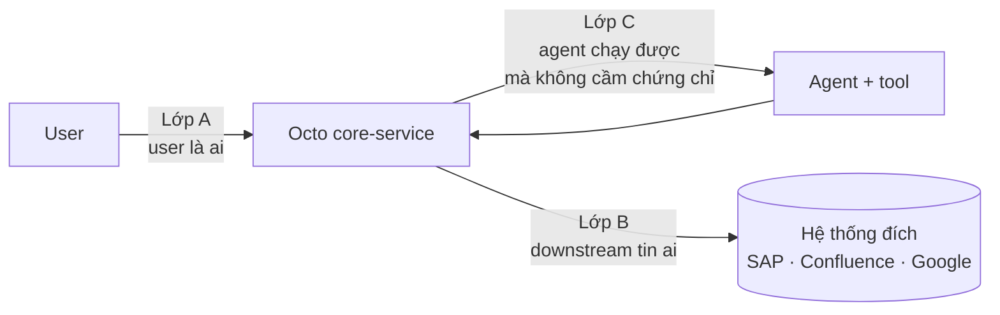
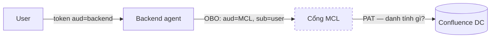

# Ủy quyền user cho agent trong Octo

Tài liệu định hướng cho Octo core: khi agent chạy một tool/CLI **nhân danh user**, danh tính của user
đi qua những chặng nào, mỗi chặng có thể chọn cơ chế gì, và Octo đang đứng ở đâu.

Viết ra vì mỗi tích hợp hiện nay (SAP ADT, Docupedia, Gemini Enterprise) đang tự giải bài toán này một
kiểu, và người làm tích hợp tiếp theo không có chỗ nào để tra.

---

## 1. Vì sao Octo có bài toán này còn coding agent trên máy cá nhân thì không

Claude Code hay Cursor chạy trên máy của chính user, bằng chính tài khoản OS của user. Không có gì để
ủy quyền: tiến trình *đã là* user rồi. Một máy, một tenant, một danh tính.

Octo thì ngược lại — **multi-tenant phía server**:

- Mọi user chung một tiến trình `core-service`, và trên BTP là chung một container
  (`mta.yaml` ghi rõ không được scale > 1 instance vì mirror object store là single-writer).
- Agent chạy **cùng tiến trình** với core-service; chỉ các tool như `bash` mới spawn tiến trình con.
- Mọi workspace là thư mục anh em dưới cùng một gốc (`core-service/src/workspaces.ts:515`).

Nên mỗi quyền phải được **cấp tường minh, phạm vi hẹp, và thu hồi được**. Không có ranh giới nào tự
nhiên mà có.

---

## 2. Bốn kiến trúc ủy quyền

Mặt bằng ngành 2026 chia làm bốn kiểu. Chúng không loại trừ nhau — một nền tảng thường dùng nhiều kiểu
cho nhiều đường khác nhau.

| Kiểu | Agent hành động dưới danh nghĩa | Dùng khi | Đánh đổi |
|---|---|---|---|
| **User-delegated** | chính user, có consent tường minh | downstream phải áp quyền theo người | Phải mang danh tính user qua mọi chặng |
| **Autonomous** | danh tính riêng của agent | job nền, không có user nào đang ngồi đó | Audit ra tên agent; phải cấp quyền riêng và siết chặt |
| **Hybrid orchestrated** | agent này ủy quyền tiếp cho agent kia | multi-agent | Chuỗi ủy quyền dài, khó truy vết |
| **Scoped impersonation** | user, **nhưng chỉ trong phạm vi hẹp** | như user-delegated, cộng yêu cầu giảm thiệt hại | Cần hạ tầng token exchange |

**Octo đang ở `user-delegated`.** Đích nên nhắm là `scoped impersonation` — giữ nguyên tính chất "log
hệ thống đích ra tên người thật", nhưng thu hẹp thứ mà một token rò rỉ mở được.

Riêng agent chạy **ngoài lượt tương tác** (reminder, job nền) thuộc `autonomous` và hiện **cố ý không
được hỗ trợ**: không có request thì không có danh tính user, broker ADT trả 401.

---

## 3. Ba lớp phải giải riêng

Đây là phần xương sống. Ba lớp dưới đây hay bị gộp làm một, và đó là nguồn gốc của phần lớn nhầm lẫn.

### Lớp A — Lấy danh tính user

Ai đang ngồi trước màn hình. Octo hiện có ba đường: XSUAA (trên BTP, `CORE_SERVICE_EDGE_AUTH=xsuaa`),
GHES OAuth SSO, và mật khẩu nội bộ. Lớp này coi như đã giải xong.

### Lớp B — Đưa danh tính xuống hệ thống đích

Đây là lớp quyết định **lộ ra thì mất gì**. Bốn lựa chọn:

| Cơ chế | Cách chạy | Token rò rỉ thì mở được gì |
|---|---|---|
| **Passthrough** | chuyền nguyên token của user xuống dưới | **Mọi thứ token đó mở được** — kể cả API của chính Octo |
| **Token exchange** (RFC 8693 / OBO) | đem token đi đổi lấy token mới, ràng `aud`, hẹp scope, thọ ngắn, mang cả hai danh tính (user + app) | Chỉ đúng một hệ thống đích |
| **Principal propagation** | BTP đổi JWT lấy SAML assertion qua Cloud Connector | (token vào vẫn là passthrough — xem §4) |
| **Credential per-user** | mỗi user tự cấp quyền một lần, hệ thống lưu hộ refresh token / PAT | Chỉ hệ đó, nhưng credential sống lâu |

Nguyên tắc: **không bao giờ dùng một tài khoản dịch vụ dùng chung** cho lớp này. Làm vậy là AI đọc
được thứ người hỏi không có quyền đọc, và log hệ thống đích ghi tên tài khoản kỹ thuật nên mất sạch
truy vết.

### Lớp C — Trao năng lực cho agent

Agent phải *chạy được* lệnh mà *không cầm* chứng chỉ. Ba lựa chọn, xếp theo độ mạnh tăng dần:

| Cơ chế | Cách chạy | Điểm yếu |
|---|---|---|
| **Env injection** | nhét token vào biến môi trường của tiến trình con | Agent `echo` ra được; cùng UID thì `/proc/<pid>/environ` đọc được |
| **Broker + capability ticket** | chứng chỉ ở lại phía server, agent cầm một vé đổi lấy *hành động* | Vé là bí mật chia sẻ — ai đọc được vé thì dùng được vé |
| **Attestation** | không có bí mật nào cả; nền tảng chứng thực caller bằng thuộc tính mức kernel (UID, cgroup, container id), kiểu SPIFFE/SPIRE | Đòi mỗi tenant phải có danh tính hệ thống riêng |

Octo đang ở **broker + ticket** cho đường ADT. Tài liệu ngành đánh giá lựa chọn này *"thực sự tốt hơn
nhồi biến môi trường tĩnh"* — nhưng cảnh báo đúng điểm yếu của nó: nếu mọi sandbox dùng chung một
endpoint thì tất cả chia sẻ một ranh giới danh tính, attestation theo từng sandbox trở nên bất khả.

> **Đã có đề xuất thay cơ chế này**, chờ phê duyệt: bỏ ticket, đưa năng lực cho agent dưới dạng **tool
> native gắn với phiên** — năng lực thành *tham chiếu* thay vì *bí mật*, nên không còn gì trên đĩa để
> đọc trộm. Chi tiết, sơ đồ luồng và ranh giới thông tin ở
> [agent-capability-tool.vi.md](agent-capability-tool.vi.md). Tài liệu đó cũng ghi lại một **lỗi danh
> tính chéo đang tồn tại** khi hai lượt chạy chồng nhau trong cùng một workspace.

---

## 4. Ba đường thật của Octo hôm nay

### SAP ADT — passthrough + principal propagation + broker

| Lớp | Chọn gì |
|---|---|
| A | XSUAA |
| B | **Passthrough**, rồi principal propagation ở approuter |
| C | Broker + ticket theo lượt |

`runAdtCli` bơm `ADT_USER_JWT` vào tiến trình con; adt-cli gửi `Authorization: Bearer <userJwt>` tới
`/adt-proxy`; approuter gọi `getDestination({ destinationName, jwt: userJwt })`
(`approuter/lib/adt-proxy.js:43`), Cloud Connector cấp SAML assertion cho **đúng user đó**, ABAP tự áp
quyền của người đó.

**Điểm mạnh riêng của đường này:** không có chặng nào bị thay danh tính giữa đường. Log SAP ra tên
người thật, không phải tài khoản kỹ thuật.

**Điểm yếu:** lớp B là passthrough. JWT đi qua tay `adt-cli` là **token vạn năng** — `aud` của nó là
Octo, nên rò ra thì mở được **mọi** route sau `requireAuth` (`core-service/src/auth.ts:110-134`),
*và* mở được `/adt-proxy`. Nặng thêm một bậc vì `/adt-proxy` mount trên `ar.first`, **chạy trước lớp
auth XSUAA của approuter** (`approuter/start.js:14`) — chỉ cần URL công khai + tên destination + JWT
là gửi được request ADT từ bất cứ đâu. Cửa sổ thiệt hại: `token-validity: 3600` (`xs-security.json`),
và XSUAA không revoke access token đã cấp.

Lớp C: sổ `adtTurns` giữ `{userId, workspaceId, jwt, routerBase}` trong RAM, khoá bằng ticket 32 byte
sinh mới **mỗi lượt chat**, xoá trong `finally`. Chi tiết ở [adt-broker-flow.vi.md](adt-broker-flow.vi.md).

### Docupedia qua MCL — OBO, nhưng dừng ở cổng

| Lớp | Chọn gì |
|---|---|
| A | Entra |
| B | **Token exchange (OBO)** tới cổng MCL — và chỉ tới đó |

Entra OBO cho ra một token `aud` = cổng MCL, `sub` = user, `azp` = app trung gian. Đến đây thì đúng
sách vở.

**Nhưng chuỗi không thể kết thúc ở Confluence**, vì Docupedia là Confluence Data Center và **chỉ nhận
PAT**: `docu-cli/src/client.js:62-68` chỉ có hai nhánh (`DOCU_TOKEN` env hoặc profile kind `pat`, đều
là `Bearer <PAT>`), và `docu-cli/CLAUDE.md:105` ghi thẳng *"There is no cookie, NTLM or Kerberos
path"*.

Chặng `MCL → Confluence` là một bước tin cậy riêng mà Entra không bảo chứng. Hai khả năng, hệ quả khác
hẳn nhau:

- **PAT dịch vụ của cổng** → Confluence thấy tài khoản dịch vụ, **không** thấy user. Tính chất "AI chỉ
  đọc được thứ user được đọc" không còn do Confluence bảo đảm; việc lọc quyền phải do MCL tự làm.
- **PAT theo từng user** → ACL được bảo đảm thật, nhưng đó là *credential per-user* chứ không phải OBO
  nữa, và mỗi người phải vào Confluence tự tạo PAT.

> ⚠️ **Chưa xác nhận.** Cần hỏi team MCL: *sau khi nhận token OBO của user, MCL gọi Confluence bằng
> danh tính gì?* Câu trả lời quyết định Octo có được coi kết quả trả về là "đã lọc quyền" hay phải tự
> phòng thủ thêm.

### Gemini Enterprise (octo-connect) — hai chế độ, và đã có token exchange thật

| Lớp | Chọn gì |
|---|---|
| A | Entra / IdP doanh nghiệp |
| B | **Credential per-user** *hoặc* **token exchange RFC 8693**, tuỳ tenant |

Đây là đường trưởng thành nhất về lớp B, và là bằng chứng nội bộ rằng token exchange dựng được trong
môi trường này:

- **Credential per-user** — `octo-connect/core-service/src/identity/google-oauth.ts`: user bấm qua màn
  hình consent của Google, hệ thống nhận `refresh_token` và lưu theo user (`put(userId, refreshToken)`,
  `:30`), rồi đổi ra access token khi cần.
- **Token exchange** — `octo-connect/core-service/src/identity/wif-exchange.ts`: đổi `id_token` của IdP
  doanh nghiệp lấy access token của Google qua STS, đúng RFC 8693
  (`grant_type=urn:ietf:params:oauth:grant-type:token-exchange`, `:18-20`). Không có màn hình consent
  nào — user đã chứng minh danh tính với IdP, Google tin qua cấu hình workforce pool.

---

## 5. Chỗ đứng hiện tại: hai lỗ đã biết

Cả hai cùng một nguyên nhân gốc: **một container, và `HostExecutor.resolvePath`
(`core-agent/src/sandbox.ts:275`) không clamp gì** — absolute path và `..` đi thẳng, nên
`read`/`write`/`glob`/`grep` với tới toàn ổ đĩa. `core-agent/src/tools/paths.ts` chỉ rút gọn đường dẫn
cho gọn output, không phải hàng rào.

**Lỗ 1 — `userJwt` plaintext trên đĩa. ĐÃ ĐÓNG 2026-08-21.** `handleSapCreateConnection` từng truyền
`--user-jwt <token>` cho `adt auth login destination`, và `config.setProfile` lưu thẳng trường đó: nó
obfuscate `password`, `clientSecret`, `refreshToken` nhưng **không** obfuscate `userJwt`. Token đó
thường đã hết hạn, nhưng nếu user vừa tạo connection xong rồi chat ngay thì agent đọc được một token
**còn sống**.

Đã sửa ở cả hai đầu: octo thôi đẩy `--user-jwt` vào argv (JWT chỉ đi qua env `ADT_USER_JWT`), và
adt-cli có danh sách `NEVER_PERSIST` (`userJwt`, `ssoToken`, `ssoUser`) chặn ở `config.save()` — mọi
đường ghi đều qua đó — đồng thời lọc lại lúc `getProfile()` để hồ sơ cũ không nuôi được token cũ.
Ticket `MYSAPSSO2` của `basicsso` cũng không còn xuống đĩa nữa: mỗi tiến trình tự bắt tay SPNEGO.

**Lỗ 2 — ticket đọc chéo được giữa các workspace.** Broker file nằm ở
`<workspaceRoot>/.octo/adt-broker.json`. Agent của workspace A đọc được file của workspace B; nếu B
đang có lượt chạy thì ticket đó **đảm bảo còn sống** → chạy lệnh ADT nhân danh B.

**Đổi sang biến môi trường không cứu được.** Hai agent là hai tiến trình cùng UID trên cùng máy; trên
Linux thì `/proc/<pid>/environ` đọc được. Endpoint cũng không có đặc điểm nào để phân biệt "agent thật
của B" với "agent A giả danh". **Ranh giới duy nhất khả dĩ là hệ thống file.**

Bài học cùng họ: IMDS của AWS từng chỉ nghe loopback và bị SSRF quét sạch, phải ra IMDSv2 với session
token + hop limit. **Loopback không phải ranh giới bảo mật khi mã không tin cậy dùng chung namespace** —
trường hợp của Octo còn nặng hơn vì dùng chung cả hệ thống file.

---

## 6. Lộ trình

### Mốc 1 — Containment (làm được ngay)

1. ~~**Bỏ `--user-jwt` khỏi argv tạo connection.**~~ **XONG 2026-08-21.** `runAdtCli` đã bơm
   `ADT_USER_JWT` qua env, và `adt-cli/src/auth.js` đọc env **trước** `profile.userJwt` — trường trong
   hồ sơ chưa bao giờ cần thiết. Hồ sơ cũ không cần dọn tay: `getProfile()` lọc trường đó ra, và lượt
   ghi kế tiếp bất kỳ sẽ xoá nó khỏi file.
2. **Path jail cho `HostExecutor`** (`core-agent/src/sandbox.ts:275`): clamp vào `cwd` + `searchRoots`,
   ra ngoài thì ném lỗi. Chạm tới `read`/`write`/`edit`/`glob`/`grep`/`attach` nên cần bộ test riêng.
3. **Bỏ ticket, chuyển sang tool native** — [agent-capability-tool.vi.md](agent-capability-tool.vi.md),
   đang chờ phê duyệt. Việc này *không thay thế* hai việc trên: nó gỡ bí mật ra khỏi đĩa, còn hai việc
   trên bịt các đường đọc file vốn độc lập. Nhưng sau khi làm thì path jail thôi là thứ đỡ toàn bộ cơ
   chế ADT, nên một lỗi trong jail không còn kéo theo mất năng lực ADT của mọi user.

### Mốc 2 — Scoping

Đưa lớp B của SAP từ *passthrough* sang *token exchange*: đổi JWT lấy token ràng `aud` trước khi đưa
cho `adt-cli`. Rò ra thì chỉ mở được cửa ADT, không mở được API Octo.

`octo-connect/core-service/src/identity/wif-exchange.ts` đã chứng minh mô hình này dựng được ở đây.
Hai ẩn số phải thử nghiệm, **chưa ai xác nhận**:

- XSUAA có grant nào cho token exchange không?
- Destination service có chấp nhận token đã đổi cho principal propagation không? PP đòi scope
  `uaa.user` (`xs-security.json`), đổi hẹp quá thì gãy.

### Mốc 3 — Isolation, rồi mới tới attestation

Container theo workspace — `ContainerExecutor` đã có sẵn trong `core-agent/src/sandbox.ts:331` nhưng
trên BTP đang chạy host mode (`mta.yaml` khởi động không có `--sandbox`). Có tách tenant thì mỗi
workspace mới có một danh tính hệ thống riêng, và chỉ khi đó attestation kiểu SPIFFE mới nói tới được.

Đây là **điều kiện cần trước khi mở cho nhiều phòng ban**: chia chung ranh giới thì audit không phân
biệt nổi ai làm gì.

---

## 7. Quy tắc cho người viết tích hợp mới

| Hệ thống đích nói giao thức gì | Dùng cơ chế nào ở lớp B |
|---|---|
| OAuth 2 / OIDC, có app registration | **Token exchange** (RFC 8693 / OBO) — ràng `aud`, hẹp scope |
| SAP on-prem | Destination + principal propagation qua Cloud Connector |
| Chỉ có PAT / API key (Confluence DC, Jira DC…) | **Credential per-user**. Tuyệt đối không dùng một tài khoản dịch vụ dùng chung |
| Đã có connector được user authorize sẵn | Passthrough token của user, tái dùng grant có sẵn |

Và ở lớp C, bất kể đường nào: **chứng chỉ ở lại phía server, agent chỉ nhận năng lực**. Nếu buộc phải
đưa một bí mật cho agent, bí mật đó phải (a) chỉ mở được đúng hành động đã định, (b) chết khi lượt kết
thúc, (c) vô dụng nếu mang ra khỏi máy.

---

## 8. Câu hỏi còn treo

1. MCL gọi Confluence bằng danh tính gì sau khi nhận token OBO? → quyết định Octo có phải tự lọc quyền
   kết quả Docupedia hay không.
2. XSUAA có hỗ trợ token exchange, và destination service có chấp nhận token đã đổi cho PP không?
3. Broker ADT **chưa verify e2e trên BTP** lần nào.

---

## Nguồn

Khẳng định về mã nguồn trong tài liệu này đều dẫn `file:line` và đã được đọc trực tiếp. Khẳng định về
mặt bằng ngành lấy từ:

- [2026 Guide to OAuth Token Exchange & Agentic AI — Strata](https://www.strata.io/blog/agentic-identity/why-agentic-ai-demands-more-from-oauth-6a/)
- [Agent Authentication & Delegated Access: OAuth Flows, Scoped Tokens, and Identity Patterns for AI Agents (2026) — Zylos Research](https://zylos.ai/research/2026-04-11-agent-authentication-delegated-access-oauth-scoped-tokens)
- [On-behalf-of identity at machine speed — Oleria](https://www.oleria.com/blog/on-behalf-of-identity-at-machine-speed)
- [Agentic Identity Explained: SPIFFE and ReBAC for AI Agents — Stacklok](https://stacklok.com/blog/agentic-identity-explained-how-to-apply-spiffe-and-relationship-based-authorization-to-ai-agents-in-2026/)
- [Decoupling Identity from Access: Credential Broker Patterns for Secure CI/CD — arXiv](https://arxiv.org/pdf/2504.14761)
